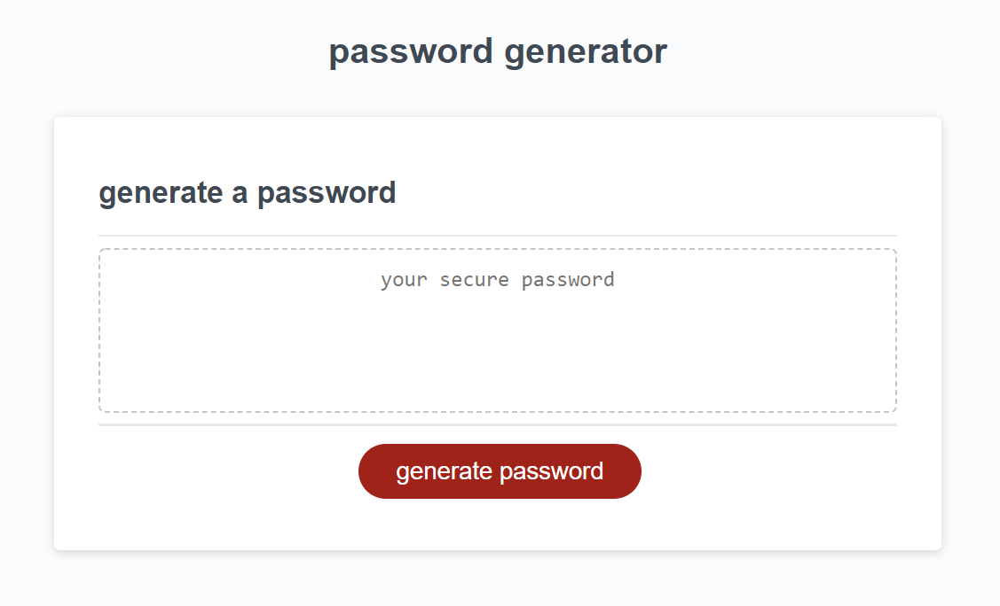

# Password Generator Project

## table of contents
- [objective](objective)
- [usage](usage)
- [visuals](visuals)
- [link](link)
## objective
- create a randomized password with requirements being choosing between 8-128 characters and at least 1 of 4 character options.

## usage
- given someone needs a new secure password, a user can click the button and go through the following propmpts to randomly generate one
- requires user to choose a number between 8 and 128, otherwise returns "please choose a valid option"
- creates variables for each case and makes user choose confirm or cancel to above questions
- alerts user to choose at least one character type if they go through all questions and don't choose any

## visuals

## link
https://gluupo.github.io/password-generator/
